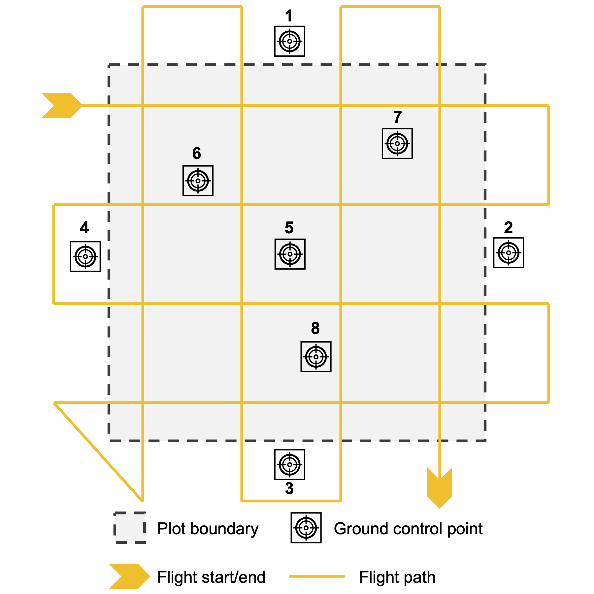

# readme for point cloud processing

## purpose

This readme gives an overview of directory structure, files, and steps for recreating
outputs and analyses for processing Digital Aerial Photogrammetry (DAP) point clouds
acquired with Unpersonned Aerial Systems (UAS). For more information, see the following report:

**Report citation:** Braziunas, K.H. and M.G. Turner. 2022. Less fuel for the fire: How will drought amplify effects of short-interval fire. Joint Fire Science Program Graduate Research Innovation Award Final Report. JFSP Project ID 20-1-01-6.

## platforms

- Operating systems and software used for development and implementation
  - OS: Windows 10
  - R version: 4.1.3

## directory overview

Directory structure and files:

- `data/`: Field plot measurements. Does not include raw point clouds, due to size constraints. These can be provided upon request.
- `figures/`: Figures comparing field measurements with UAS DAP-derived data.
- `processed_data/`: Data altered from raw form. Includes tree top locations, segmented point clouds, canopy height models, summary statistics, and forest structure outputs.
- `report/`: Final report submitted to Joint Fire Science Program.
- `scripts/`: R scripts.

## scripts

Scripts are named in order (`step01_`, etc.).

Script descriptions:

- `step01_initial_las_processing.R`: Performs initial processing to remove duplicate points, retain only aboveground points, normalize to a digital elevation model, create a canopy height model, identify tree tops, and segment the point cloud. Inputs are not included; outputs are in `processed_data/`.
- `step02_uas_plot_measurements.R`: Derives plot measurements from segmented point clouds with individually identified trees. Classifies snags versus trees; counts stems, trees, and snags; estimates plot-level summary heights; and estimates plot-level biomass using allometric equations. Inputs and outputs in `processed_data/`.
- `step03_uas_field_comparison.R`: Compares UAS DAP-derived data with independent field measurements using 1:1 plots and normalized root-mean-square error. Inputs in `data/` and `processed_data/`. See include report in `report/` for overview and discussion of results.

## methods (from report)

In a subset of three 15-year-post-fire plots that burned in the 2006 Derby Fire and ranged from low to high post-fire tree density, overlapping imagery was acquired using a DJI Phantom 4 Pro V2.0. Eight GCPs were placed within or immediately outside the plot (see Figure). One GCP was located at or near plot center, four at or near the midpoint on each side of the plot, and three distributed within the plot; starting from these locations, we placed GCPs in areas that were relatively flat and with minimal overhead vegetation that would obstruct the view from above. GCP locations were recorded with using an EMLID Reach RS2 base station and rover Global Positioning System (GPS) setup. Relative to the base station, GCP vertical accuracy averaged 0.011 m root-mean-square error (RMSE) and horizontal accuracy averaged 0.014 m RMSE. The UAS was equipped with two sensors, a conventional built-in sensor measuring red, green, and blue wavelengths (~660/550/470 nm, respectively; Fernandez-Figueroa et al. 2022; 20 megapixel resolution; hereafter "RGB") and a MAPIR Survey 3W sensor that measured red, green, and near-infrared wavelengths (660/550/850 nm, respectively; 12 megapixel resolution; hereafter "RGN"). Missions were flown within 1.5 hours of solar noon and planned using Map Pilot Pro software at 40 m above ground level, although flying altitude varied due to underlying topography. Each plot was flown twice in a grid pattern (see Figure), once with sensors directed straight down (nadir) and the second with sensors directed at an angle (oblique, 15° RGB, 10° RGN). Raw imagery (i.e., RAW format) was collected with 75% lateral overlap and either 75% forward overlap (RGB) or approximately 90% forward overlap (RGN). A photo of a MAPIR reflectance calibration target was taken immediately before each flight.

We performed DAP processing for different potential scenarios for ground control points (0, 1, 5, or 8) and sensor angles (nadir only or nadir plus oblique) for RGN imagery only, because we expected collecting near infrared reflectance would improve tree versus snag detection relative to RGB imagery. Prior to DAP processing, radiometric calibration was performed for RGN images using MAPIR software and the corresponding calibration reflectance target photo. RGB and RGN imagery were separately processed using Agisoft Metashape Professional 1.6.2 to create classified 3D point clouds, orthorectified image mosaics, and digital elevation models (DEMs) for each plot. Processing parameters included: ultra high accuracy (50,000 keypoints, 10,000 tiepoints), mild filtering, and point classification as belowground, ground, or aboveground (0.7 m cell size, 1.1° max angle, 1.0 m max distance, which were recommended as default values by local experts). The DEM was created from points classified as ground using Inverse Distance Weighting interpolation.

Forest structure estimation and snag classification was performed in R 4.1.3 (R Core Team 2022), primarily using the lidR package (Roussel et al. 2020). Point clouds were first filtered to remove duplicates and normalized to the DAP-derived DEM. Tree tops were located using points classified as aboveground (> 0.1 m height) and a 1 m diameter moving window to detect local maxima. Individual points were then assigned to a tree (i.e., tree segmentation; Dalponte and Coomes 2016). Trees > 1.4 m height were classified as either tree or snag using unsupervised k-means classification on the mean, max, and coefficient of variation of all three bands (RGB or RGN). Based on iterative trial runs, we used 10 clusters and classified snags as the cluster with the highest mean blue intensity for RGB or lowest mean near-infrared intensity for RGN. We classified all individual trees > 5 m height as snags given that young regenerating trees were shorter. Stems and snags were tallied by height class (live stems > 0.1 m height, trees > 1.4 m height, snags) and summarized by DAP-derived mean, 90th percentile, and max height. Total live aboveground biomass was estimated by summing individual whole tree biomass derived from allometric equations based on height (Brown 1978). Plot measurements derived from UAS DAP were compared to field measurements using 1:1 lines and normalized RMSE; differentiation between snags and trees was visually assessed based on point clouds; and sampling effort, cost, post-processing time, and point cloud and DEM error and resolution were evaluated for different data collection methods.

*Note*: See report for introductory material, results, discussion, and literature cited.

## see also

There are excellent best practices and step-by-step guides for acquiring data with UAS and processing point clouds.

For best practices, see [this guide](https://ckine.github.io/GOA_BPG_PUB/).

The scripts developed for this project were largely based on the guide for the `lidR` R package, available [here](https://r-lidar.github.io/lidRbook/).
